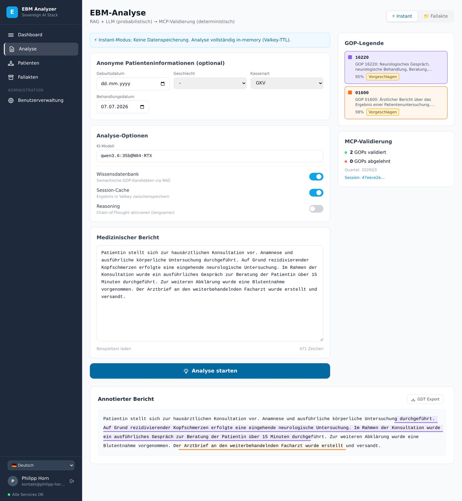
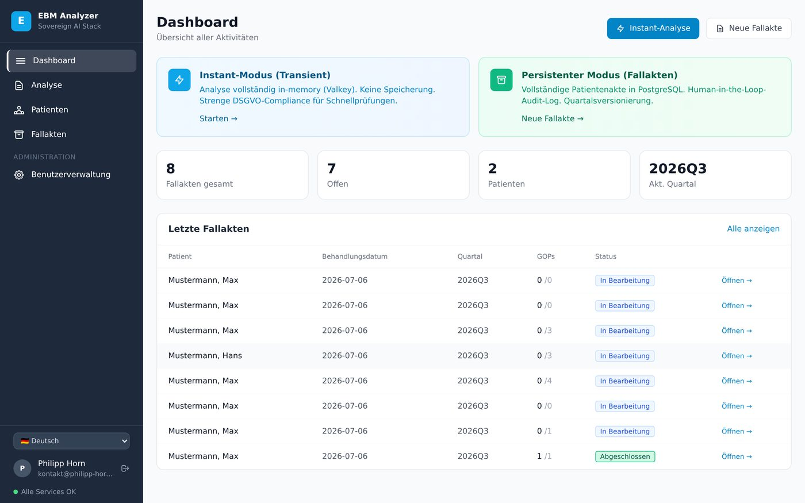
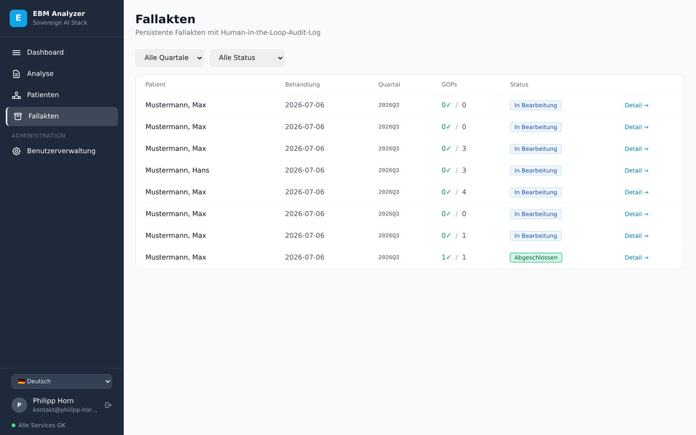
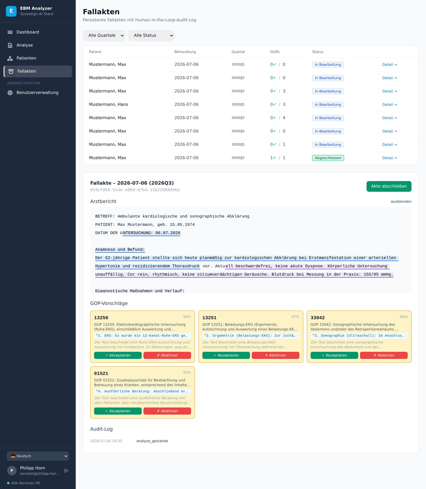
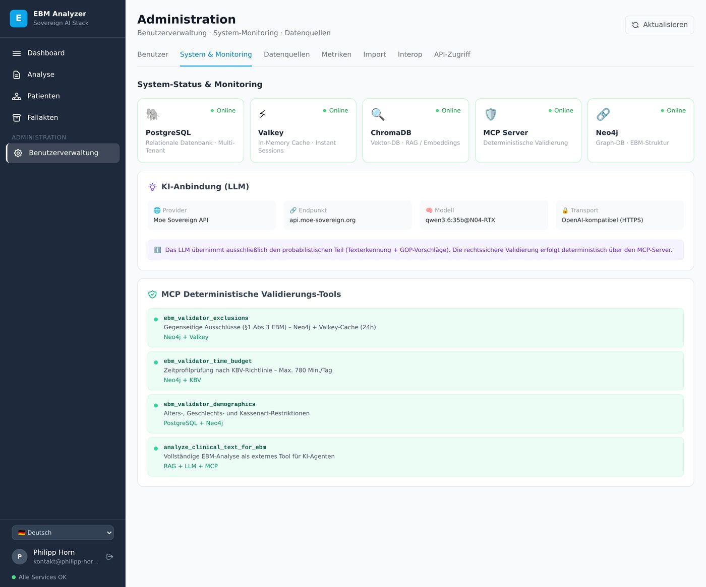
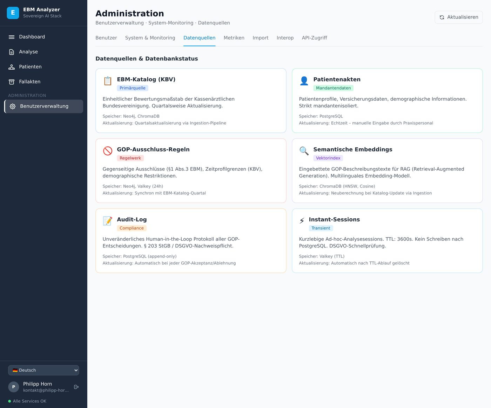
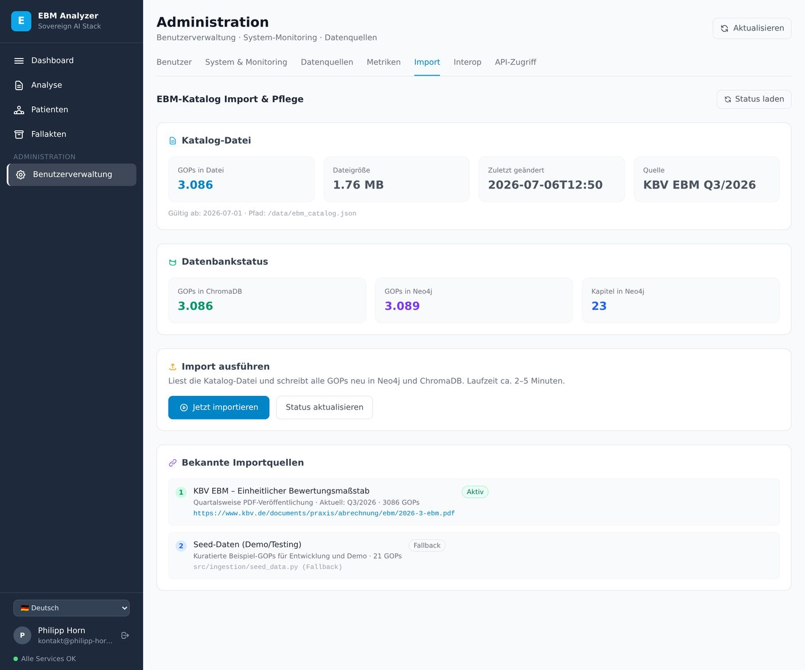
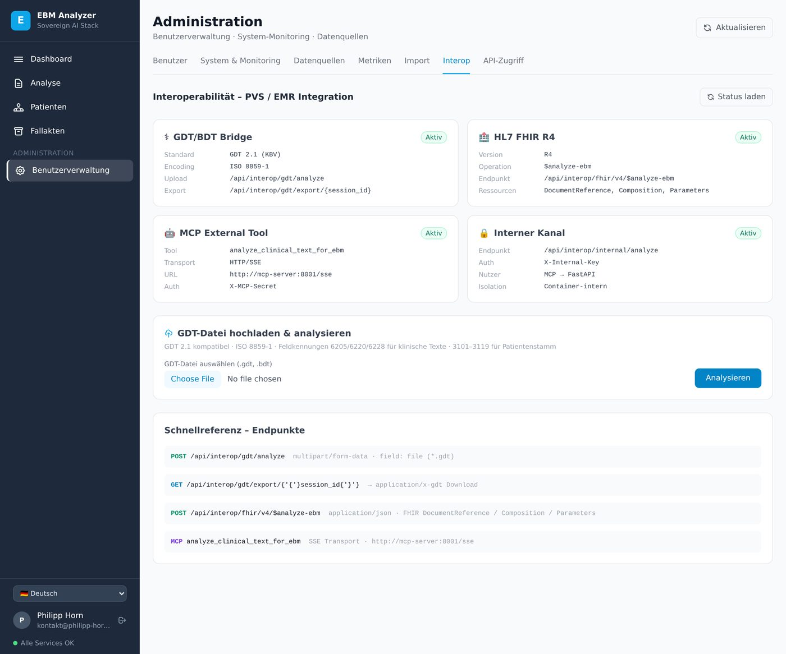
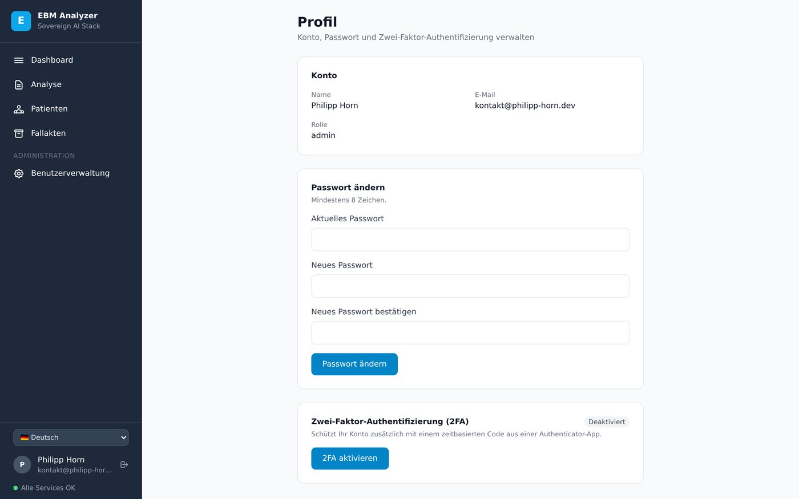
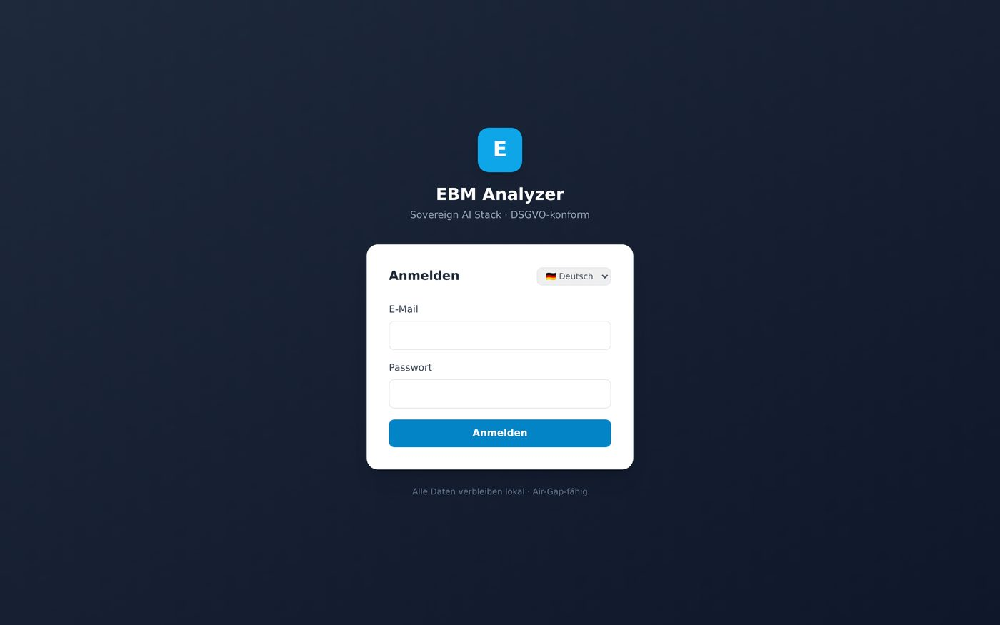

# Screenshots

Alle Aufnahmen stammen aus einer laufenden Instanz mit Testdaten (Platzhalterpatient „Mustermann"). Die Analyse-Ergebnisse sind echt — keine gestellten Mockups. Klick auf ein Bild öffnet es in Originalgröße.

## Analyse-Ergebnis

Ergebnis einer echten Instant-Analyse mit einem lokal gehosteten `qwen3.6:35b`: links der Bericht mit farblich hervorgehobenem Textbeleg, rechts die GOP-Legende und die MCP-Validierungs-Kennzahlen (validiert/abgelehnt, Quartal, Session). Die Hervorhebungsfarben im Bericht entsprechen exakt den Farben in der Legende.

{target=_blank}

## Dashboard

Übersicht über Instant- und Persistent-Modus, offene Fallakten und Kennzahlen des aktuellen Quartals.

{target=_blank}

## Fallakten

Fallakten-Liste mit Status, GOP-Anzahl und Quartalszuordnung.

{target=_blank}

## Fallakte im Detail

Fallakte `819cfd50-514e-4859-87b4-13a223880062` (2026-07-06, 2026Q3) mit eingeblendetem Arztbericht (Textbeleg farblich markiert) und den vier noch offenen GOP-Vorschlägen samt Konfidenz, Textbeleg und Human-in-the-Loop-Entscheidung (Akzeptieren/Ablehnen). Darunter das Audit-Log.

{target=_blank}

## Administration

### System & Monitoring

Live-Status aller Backend-Dienste (PostgreSQL, Valkey, ChromaDB, MCP-Server, Neo4j), die aktive LLM-Anbindung und die deterministischen MCP-Validierungswerkzeuge.

{target=_blank}

### Datenquellen

Übersicht aller Datenquellen des Systems: EBM-Katalog, Patientenakten, GOP-Ausschlussregeln, semantische Embeddings, Audit-Log und Instant-Sessions — jeweils mit Speicherort und Aktualisierungsrhythmus.

{target=_blank}

### Import

EBM-Katalog-Import: Katalogdatei-Metadaten, aktueller Datenbankstatus (GOPs in ChromaDB/Neo4j) und die bekannten Importquellen (KBV-Primärquelle, Seed-Daten-Fallback).

{target=_blank}

### Interoperabilität

Status aller Interop-Schnittstellen: GDT/BDT-Bridge, HL7 FHIR R4, MCP External Tool und interner Kanal.

{target=_blank}

## Profil: Passwort & 2FA

Selbstverwaltung: Passwort ändern und Zwei-Faktor-Authentifizierung (TOTP) aktivieren.

{target=_blank}

## Login

Anmeldeseite — Session läuft über ein httpOnly-Cookie, serverseitig geprüft vor jedem Seitenaufruf.

{target=_blank}
